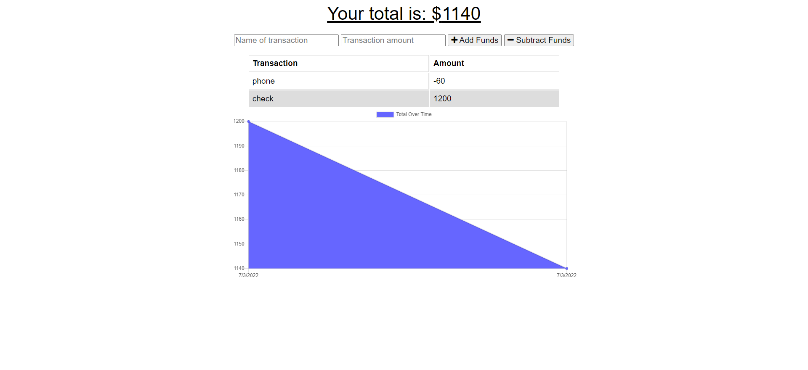

# financial-tracker

## Description

This application allows you to manage your financial budgets, also if there is not internet this application will still be functioning. Once you have internet again then all that you have done offline will be saved.

## Installation

```
npm install compression express mongoose morgan
```

```
npm start
```

## Screenshot



## Link

https://financial-budget-tracker.herokuapp.com/

## Author

Hector Castaneda strides to learn all he can in web development. To achieve the ability to become a full stack developer. Please visit his github: https://github.com/Hectcast508.
